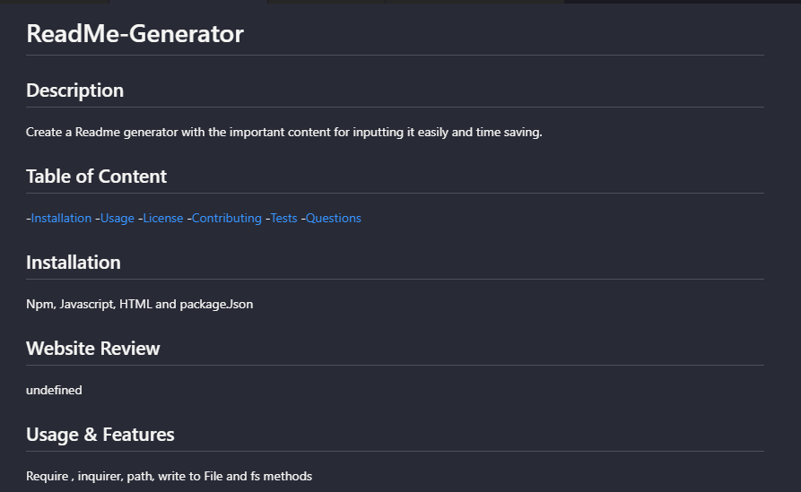

# ReadMe-Generator
  
  ## Description
  Create a Readme generator with the important content for inputting it easily and time saving.

  ## Table of Content

  -[Installation](#installation)
  -[Usage](#usage)
  -[License](#license)
  -[Contributing](#contributing)
  -[Tests](#tests)
  -[Questions](#questions)

  ## Installation
  Npm, Javascript, HTML and package.Json

  ## Website Review
  Result:

 Video:
[![Watch the video]] (C:\Users\vicky.mf.wong\bootcamp\04-readme-generator-lesson\challenge\starter\images\Video.gif)

  ## Usage & Features
  Require , inquirer, path, write to File and fs methods

  ## License 
  
  MIT

  ## Contributing and Credits
  Thanks for TA and teammates to work together

  ## Tests
  Completed the test

